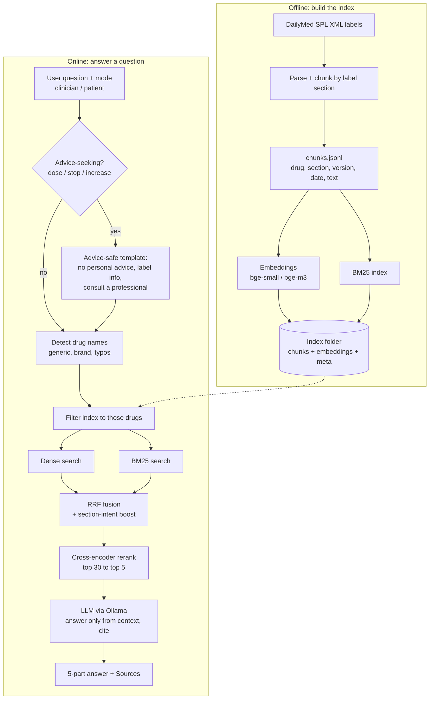

# Drug Label Q&A Chatbot (RAG)

Cognizant NPN hackathon, use case 8. A retrieval-augmented chatbot that answers questions about prescription drugs
from official DailyMed labels, with citations, clinician and patient modes, and safety-aware responses.

> Status: retrieval module (this README's "Retrieval" parts) is done and tested against **mock** data.
> Data pipeline, generation/safety, evaluation and UI plug in through the contracts below.

## Architecture



Owners: Shruti = OFFLINE box, Kartik = detect / filter / search / fusion / rerank, Ankita = advice check + LLM + answer format,
Akansha = evaluation + UI.

The final answer always uses the mentor's format: **Direct answer / What the prescribing information says /
Important safety information / What to do next / Sources** (drug name, label version, section, page, effective date).

## Setup (Windows)

```
python -m venv venv
venv\Scripts\activate
pip install -r requirements.txt
```

The offline `hash` embedder and the tests need only `numpy` and `pytest`. Real embeddings and the reranker need
`sentence-transformers`; models download on first use.

## Quick start (no data needed)

```
python scripts\make_mock_data.py
python scripts\build_index.py --chunks data\mock_chunks.jsonl --out index\mock --embedder hash
python scripts\demo_retrieve.py --index index\mock --compare "Can I take ibuprofen with warfarin?"
python -m pytest -q
```

With real data and real models:

```
python scripts\build_index.py --chunks data\chunks.jsonl --out index\bge-small --embedder bge-small
python scripts\demo_retrieve.py --index index\bge-small --reranker bge-reranker-base --mode hybrid_rerank "contraindications of metformin"
```

## Using retrieval from Python

```python
from drugrag.retrieval import Retriever, format_context
from drugrag.schema import format_citation

r = Retriever.from_dir("index/bge-small", reranker="bge-reranker-base")
res = r.retrieve("Can I take ibuprofen with warfarin?", mode="hybrid_rerank", top_k=5)

res.detected_drugs            # ['ibuprofen', 'warfarin']
res.hits[0].chunk             # Chunk dataclass (text, drug_name, section, version, ...)
res.hits[0].score, .rank      # rank is 1-based
res.notes                     # e.g. "no reranker configured; returned hybrid results"
format_context(res.hits)      # "[1] Warfarin, label version 3, Drug Interactions, ...\n<text>\n\n[2] ..."
format_citation(res.hits[0].chunk)
```

`retrieve(query, mode, top_k, drugs, section_boost, candidate_k)`

| Argument | Meaning |
|---|---|
| `mode` | `dense`, `bm25`, `hybrid`, `hybrid_rerank` (rows of the ablation table) |
| `drugs` | `None` = auto-detect from the query, `[]` = no drug filter, `["warfarin"]` = force |
| `section_boost` | turn the section-intent boost off for ablation |
| `candidate_k` | how many fused candidates go to the reranker (default 30) |

## Contracts between modules

**Chunk** (`drugrag/schema.py`), one JSON object per line in `chunks.jsonl`:

| Field | Example | Notes |
|---|---|---|
| `chunk_id` | `metformin-<set_id>-contraindications-0` | unique |
| `drug_name` | `metformin` | lowercase generic name, used for filtering |
| `aliases` | `["glucophage"]` | brand names, used for drug detection |
| `section` | `Contraindications` | human readable, shown in citations |
| `section_code` | `34070-3` | LOINC code of the SPL section |
| `text` | passage | what gets embedded and quoted |
| `set_id`, `version`, `effective_date` | `...`, `3`, `2024-05-01` | for the Sources line |
| `page` | `N/A` | XML has no pages; PDFs get the page number |
| `source_url` | DailyMed link | |

**Generation** (Ankita): `answer(query, hits, mode) -> Answer` where `mode` is `"clinician"` or `"patient"`.
**Evaluation** (Akansha): loop `for mode in MODES: retriever.retrieve(q, mode=mode)` and compare `chunk_id` / `section` to the gold set.

## Design choices and rationale

| Decision | Why |
|---|---|
| Chunk by label section | A "Contraindications" chunk answers contraindication questions cleanly and gives a precise citation. |
| Prefix `drug - section` to the embedded text | A chunk that only says "Hypersensitivity..." still knows which drug and section it belongs to. |
| Drug detection + metadata filter before search | Prevents wrong-drug answers, the worst failure here. Handles brand names and typos. |
| Hybrid (dense + BM25) with reciprocal rank fusion | Dense handles meaning ("side effects" ~ "adverse reactions"); BM25 handles exact doses and names. RRF needs no score tuning. |
| Section-intent boost | Questions like "what is the dose" or "can I take X with Y" point to a section. Small additive boost, can be turned off for ablation. |
| Cross-encoder reranker on top 30 | Largest precision gain for little code; only 30 passages are scored per query. |
| Plain numpy index, no vector DB | Exact search, trivial filtering, ~46 MB for 30k chunks at 384-d. Swap in Chroma/FAISS only if the corpus grows by orders of magnitude. |
| Swappable embedder (`bge-small` / `bge-m3` / `minilm`) | Mentor asked for lightweight embeddings on modest hardware. Same code, one flag. The index records which model built it and refuses a mismatched one. |
| Open-source stack (Ollama + local models) | Mentor preference; no API keys or cost. |

## Known limitations (also good for the failure-analysis slide)

- The `hash` embedder and `overlap` reranker are offline stand-ins for wiring and tests. They are **not semantic**:
  on mock data, plain `dense` and `bm25` miss some queries (for example "side effects" vs the section named
  "Adverse Reactions"); `hybrid` recovers them through the section boost. Real quality numbers need `bge-*` models.
- Fuzzy drug matching needs a token of 6+ letters and similarity above 0.82; very short names or heavy misspellings are missed.
- Two drugs in one query (interaction questions) retrieve from both labels; a drug that is not in the index falls back to unfiltered
  search and sets a note, which generation should turn into "not found in the labels I have".
- `data/mock_chunks.jsonl` is invented paraphrase for testing. Never use it in the demo or the evaluation.

## Checkpoint 1 checklist

- [ ] Data collected (Shruti) | [ ] Parsing and chunking (Shruti) | [x] Embedding generation script | [x] Vector index setup
- [ ] Initial retrieval results on real data (`demo_retrieve.py --compare`)

## Repo layout

```
drugrag/
  schema.py            Chunk dataclass, load/save, citation format
  retrieval/           embedder, bm25, drug_detect, index, rerank, retrieve   <- Kartik
  pipeline/            parsing + chunking                                     <- Shruti
  generation/          prompts, safety, answer                                <- Ankita
  eval/                gold set + metrics                                     <- Akansha
  mock_data.py         30 mock chunks for development
app/                   Streamlit UI                                           <- Akansha
scripts/               make_mock_data.py, build_index.py, demo_retrieve.py
tests/                 test_retrieval.py
```
